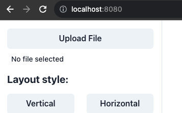
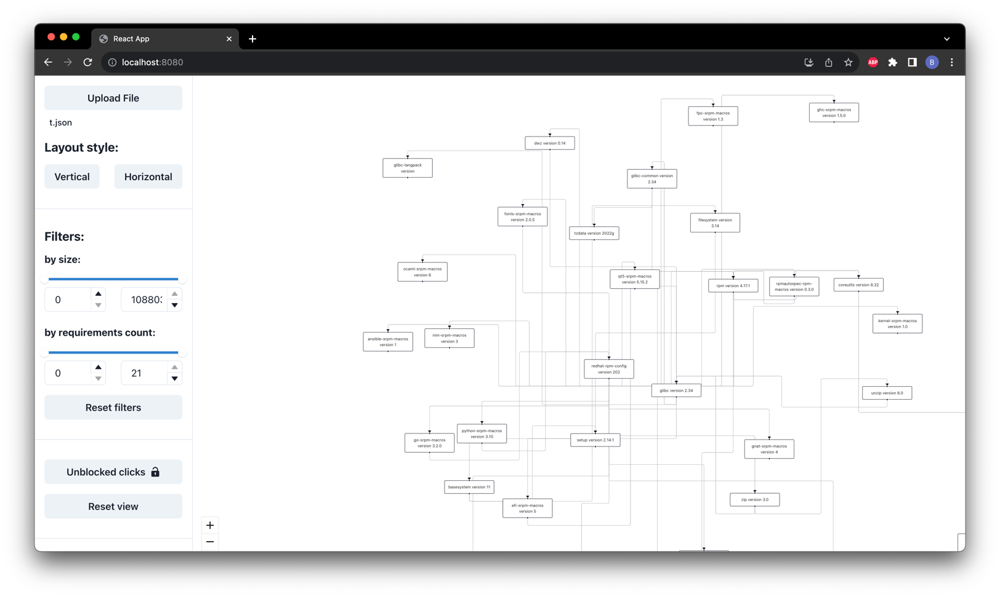

# risc-v-binary-watcher

## Утилита командной строки

### Загрузка:

```shell
curl -L https://github.com/AbsoluteNikola/risv-binary-watcher/releases/download/{VERSION}/binary_watcher -o ./binary_watcher
```

_Акуальная версия v0.0.1-analyzer, бинарник для GNU Linux x86-64_

### Использование
```shell
./binary_watcher rpm имя_пакета папка_для_вывода_результата
```
В stdout выведется JSON предсталвение графа. Его необходимо загрузить в виде файла во Viewer

```shell
./binary_watcher imports папка_с_проектом
```
В stdout выведется JSON представления графа зависимостей import в go проекте (не интегрированно с фронтом)
```shell
./binary_watcher packages корневая_папка_содержащая_все_рассматриваемые_пакеты
```
В stdout выведется JSON со списком зависимостей всех проектов в корневой папке (не интегрированно с фронтом)


## Viewer

Загрузка образа, создание и запуск контейнера:
```shell
docker run -p 8080:8080 -it  ghcr.io/absolutenikola/risv-binary-watcher:release
```

_веб-сервер будет запущен на порте 8080, подключиться можно по URL http://localhost:8080_

Необходимо загрузить файл, полученный из утилиты командной строки, на эту веб-страницу. Для этого
необходимо воспрользоваться кнопкой Upload File:



В результате загрузится граф:

